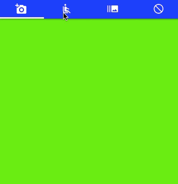

# TabbarDemo 
## Android like tabbar in iOS (Swift 4)

> Use TabbarView class to show the tab bar

	
 - Add tabs
		let tabView = TabbarView()
		tabView.addOver(superView: self.mTabView)

		let tab1 = Tab1()
		tab1.backgroundColor = UIColor.green
		try? tabView.add(tab: tab1)

		let tab2 = Tab2()
		tab2.backgroundColor = UIColor.gray
		try? tabView.add(tab: tab2)

		let tab3 = Tab3()
		tab3.backgroundColor = UIColor.yellow
		try? tabView.add(tab: tab3)

		let tab4 = Tab4()
		tab4.backgroundColor = UIColor.orange
		try? tabView.add(tab: tab4)

- define each tab

		class Tab1: UIView, TabbarViewDelegate {

		var title:String { return "Tab1"}
		var icon: UIImage? {return UIImage(named: "ic_add_a_photo_white_24dp.png") }

		func viewSelected(_ tabView: TabbarView) {
		}

		func viewDidDisappear(_ tabview: TabbarView) {
		}

		func reloadTab(_ tabview: TabbarView) {
		}

		}

> Each tab class must implement UIView and TabbarViewDelegate

-
-
-
-
# Demo

